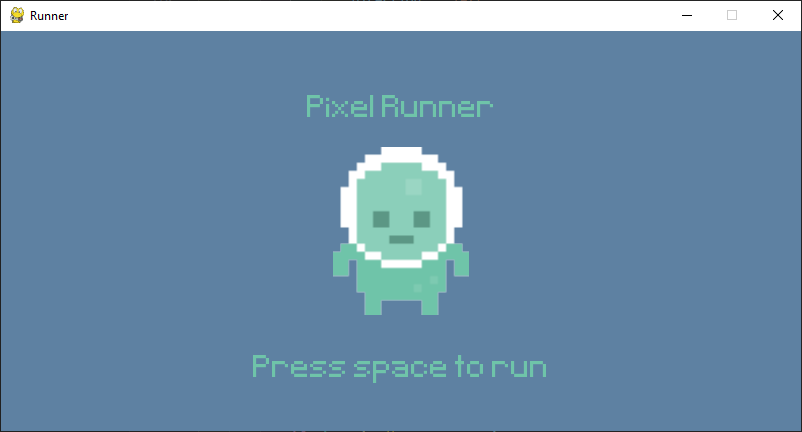
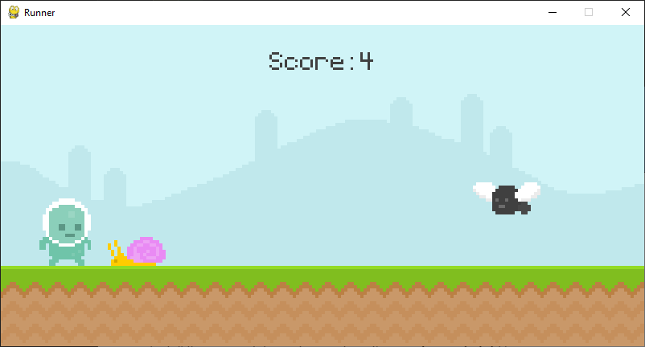
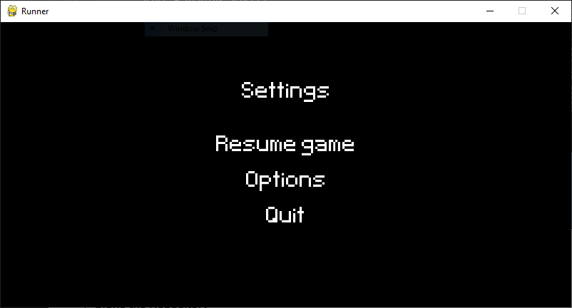
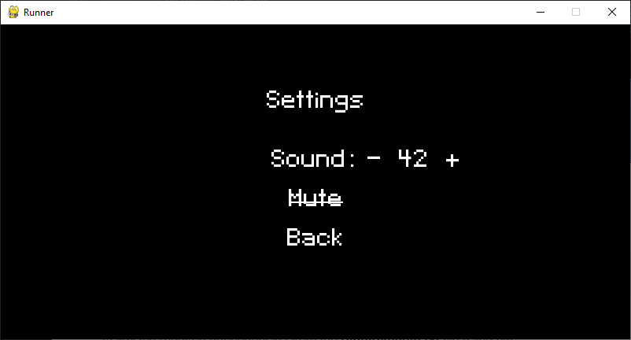

# Runner Game
## Overview
Runner Game is a Python-based game that utilizes the pygame package to create an entertaining gaming experience.

<p align="center">
  <strong>Main Page</strong>
</p>



<p align="center">
  <strong>Play Page</strong>
</p>



<p align="center">
  <strong>Menu Page</strong>
</p>





## How to use
1. **Clone the Repository**
    ```bash
    git clone https://github.com/S-CW/pygame-runner.git
    ```

2. **Install Dependencies**
    Install the required dependencies from the **requirements.txt** file using pip.
    ```bash
    pip install -r requirements.txt
    ```

3. **Run the Game**
    To start the game, open a terminal and run the following command:
    ```bash
    python runner.py 
    ```


## Control
1. Press **P** to open setting menu

2. Press **M** ingame to mute/unmute

3. Press ⬆️ or **SPACE** to jump

4. Press ⬅️ or **A** to move left

5. Press ➡️ or **D** to move right


## Variable
1. **spawn_rate_type**: A list of monster type that control the spawn rate of monster type. As of now only two monster type is available: bird, snail.
**Usage**
`
    ['fly', 'snail', 'snail', 'snail']
`
2. **Obstacle.acceleration**: Control the acceleration speed of obstacle over time.

## Future development
Here are some planned enhancements for future development:

- [x] **Adjustable Background Music Volume**
    Allow users to adjust the volume of the game to their preference.
- [x] **Progressive Difficulty**
    Implement a feature where the game's speed gradually increases as the player's score goes up, making the game more challenging over time.
- [ ] **Additional Scoring Opportunities**


## Updates
- Added a feature just for fun. Play and reach score 50 to reach meme phase
